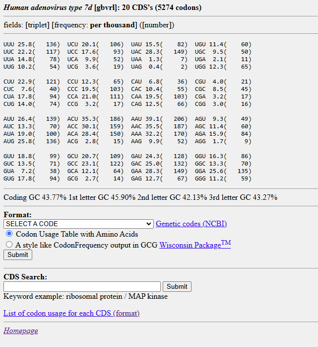

# Kazusa_to_emboss_codon_usage_table

This script allows to convert the codon usage tables that are found in [Kazusa Codon Usage Database](https://www.kazusa.or.jp/codon/) to be used with EMBOSS tools

Usage example for the Human adenovirus type 7d:

- From the table page in Kazusa website copy the table text

fields: [triplet] [frequency: per thousand] ([number])
UUU 25.8(   136)  UCU 20.1(   106)  UAU 15.5(    82)  UGU 11.4(    60)
UUC 22.2(   117)  UCC 17.6(    93)  UAC 28.3(   149)  UGC  9.5(    50)
UUA 14.8(    78)  UCA  9.9(    52)  UAA  1.3(     7)  UGA  2.1(    11)
UUG 10.2(    54)  UCG  3.6(    19)  UAG  0.4(     2)  UGG 12.3(    65)

CUU 22.9(   121)  CCU 12.3(    65)  CAU  6.8(    36)  CGU  4.0(    21)
CUC  7.6(    40)  CCC 19.5(   103)  CAC 10.4(    55)  CGC  8.5(    45)
CUA 17.8(    94)  CCA 21.0(   111)  CAA 19.5(   103)  CGA  3.2(    17)
CUG 14.0(    74)  CCG  3.2(    17)  CAG 12.5(    66)  CGG  3.0(    16)

AUU 26.4(   139)  ACU 35.3(   186)  AAU 39.1(   206)  AGU  9.3(    49)
AUC 13.3(    70)  ACC 30.1(   159)  AAC 35.5(   187)  AGC 11.4(    60)
AUA 19.0(   100)  ACA 28.4(   150)  AAA 32.2(   170)  AGA 15.9(    84)
AUG 25.8(   136)  ACG  2.8(    15)  AAG  9.9(    52)  AGG  1.7(     9)

GUU 18.8(    99)  GCU 20.7(   109)  GAU 24.3(   128)  GGU 16.3(    86)
GUC 13.5(    71)  GCC 23.1(   122)  GAC 25.0(   132)  GGC 13.3(    70)
GUA  7.2(    38)  GCA 12.1(    64)  GAA 28.3(   149)  GGA 25.6(   135)
GUG 17.8(    94)  GCG  2.7(    14)  GAG 12.7(    67)  GGG 11.2(    59)

- Save it as txt file
- Input the file to the python script
  kazusa_table_converter.py input_file.txt output_file.txt
