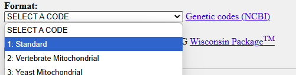
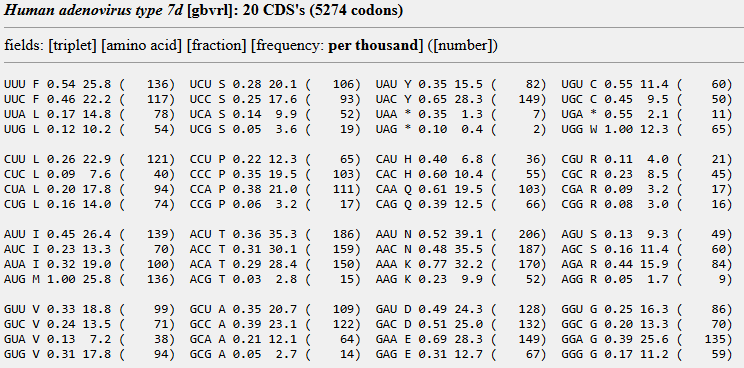

# Kazusa to emboss codon usage table converter
 
This script allows to convert the codon usage tables that are found in [Kazusa Codon Usage Database](https://www.kazusa.or.jp/codon/) to be used with EMBOSS tools

## Usage example for the Human adenovirus type 7d:

- From the table page in Kazusa website copy the table text
  

- Select the code "standard" and submit <br>
  

  You will get this type of table: <br>
  
  
```
fields: [triplet] [amino acid] [fraction] [frequency: per thousand] ([number])
UUU F 0.54 25.8 (   136)  UCU S 0.28 20.1 (   106)  UAU Y 0.35 15.5 (    82)  UGU C 0.55 11.4 (    60)
UUC F 0.46 22.2 (   117)  UCC S 0.25 17.6 (    93)  UAC Y 0.65 28.3 (   149)  UGC C 0.45  9.5 (    50)
UUA L 0.17 14.8 (    78)  UCA S 0.14  9.9 (    52)  UAA * 0.35  1.3 (     7)  UGA * 0.55  2.1 (    11)
UUG L 0.12 10.2 (    54)  UCG S 0.05  3.6 (    19)  UAG * 0.10  0.4 (     2)  UGG W 1.00 12.3 (    65)

CUU L 0.26 22.9 (   121)  CCU P 0.22 12.3 (    65)  CAU H 0.40  6.8 (    36)  CGU R 0.11  4.0 (    21)
CUC L 0.09  7.6 (    40)  CCC P 0.35 19.5 (   103)  CAC H 0.60 10.4 (    55)  CGC R 0.23  8.5 (    45)
CUA L 0.20 17.8 (    94)  CCA P 0.38 21.0 (   111)  CAA Q 0.61 19.5 (   103)  CGA R 0.09  3.2 (    17)
CUG L 0.16 14.0 (    74)  CCG P 0.06  3.2 (    17)  CAG Q 0.39 12.5 (    66)  CGG R 0.08  3.0 (    16)

AUU I 0.45 26.4 (   139)  ACU T 0.36 35.3 (   186)  AAU N 0.52 39.1 (   206)  AGU S 0.13  9.3 (    49)
AUC I 0.23 13.3 (    70)  ACC T 0.31 30.1 (   159)  AAC N 0.48 35.5 (   187)  AGC S 0.16 11.4 (    60)
AUA I 0.32 19.0 (   100)  ACA T 0.29 28.4 (   150)  AAA K 0.77 32.2 (   170)  AGA R 0.44 15.9 (    84)
AUG M 1.00 25.8 (   136)  ACG T 0.03  2.8 (    15)  AAG K 0.23  9.9 (    52)  AGG R 0.05  1.7 (     9)

GUU V 0.33 18.8 (    99)  GCU A 0.35 20.7 (   109)  GAU D 0.49 24.3 (   128)  GGU G 0.25 16.3 (    86)
GUC V 0.24 13.5 (    71)  GCC A 0.39 23.1 (   122)  GAC D 0.51 25.0 (   132)  GGC G 0.20 13.3 (    70)
GUA V 0.13  7.2 (    38)  GCA A 0.21 12.1 (    64)  GAA E 0.69 28.3 (   149)  GGA G 0.39 25.6 (   135)
GUG V 0.31 17.8 (    94)  GCG A 0.05  2.7 (    14)  GAG E 0.31 12.7 (    67)  GGG G 0.17 11.2 (    59)
```
- Save it as txt file
- Input the saved file to kazusa_table_converter.py script
  '''kazusa_table_converter.py input_file.txt output_file.txt'''

## License 

This project is licensed under a permissive free-use license. You are free to use, modify, and distribute this project, but please provide attribution by mentioning the original author.
